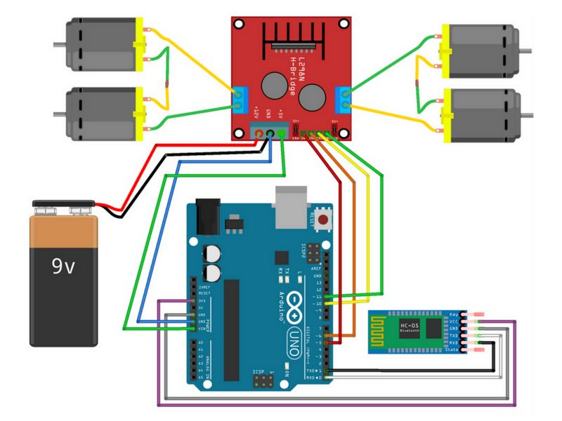

# bluetooth_controlled_car
Bluetooth controlled robot car using Arduino Board.

# Description

This car is controlled via an Android App through which signals are sent to bluetooth module which is attached to the Arduino Board.

This is a wireless robot car hence the batteries are fitted in the car itself. The chassis is made of plywood as it has very light weight.

# Equipment

1. Gear Motors (quantity = 4)

2. Motor Driver(L298N or L293D) (quantity = 1)

3. HC-05 Bluetooth Module(You Can use HC-06 as well) (quantity = 1)  

4. Arduino Uno R3 Board(Micro Controller) (quantity = 1)

5. 4v Lead Acid Battery (quantity = 2)

6. Soldering gun and equipment

7. Male to Female wires and Female to Female wires for connections (quantity = required)

# Download link for Arduino IDE

https://www.arduino.cc/en/Main/Software

To upload the code to the Arduino Board, just plugin the Arduino to your computer and then edit the code and click the upload button.

* Note:
When uploading the code to Arduino Board the Bluetooth module's Rx and Tx pin should be opened.

# App for Controlling the Car

Download Link:

https://play.google.com/store/apps/details?id=braulio.calle.bluetoothRCcontroller

# Circuit Diagram

# Video Link

https://drive.google.com/open?id=1-ckaNT6a7-HTjCPYCiCJ9C17n4iDG38x
